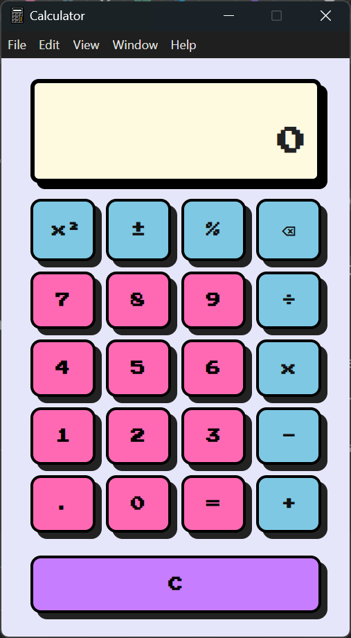

*A unique desktop calculator app featuring a bold Neo Brutalism design.*

---

## Overview

This **Calculator** app is built using **ElectronJS** and showcases a striking **Neo Brutalism** style - combining vivid colors like pink, blue, and purple with sharp, blocky shadows and a retro-inspired monospace font.
It's designed to be both functional and visually distinctive compared to traditional calculator.

---

## Features

- Basic arithmetic operations: addition, subtraction, multiplication, division  
- Special functions: square, percentage, toggle sign (±), backspace  
- Clean layout using CSS Grid  
- Interactive buttons with sharp, non-blurred shadows  
- Runs as a desktop app on Windows, macOS, and Linux  

---

## Technology Stack

- **ElectronJS**: for cross-platform desktop app development
- **HTML & CSS**: Neo brutalism themed UI
- **JavaScript**: Calculator logic and UI interaction (renderer process)

---

## Getting Started

1. CLone this repository:
```bash
git clone https://github.com/silviansi/electronjs-calculator.git
cd electronjs-calculator
```

2. Install dependencies:
```bash
npm install
```

3. Run the app:
```bash
npm start
```